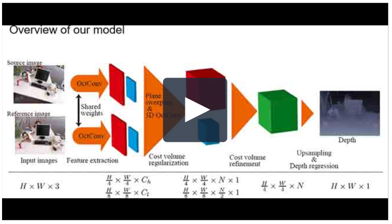

# OctDPSNet
PyTorch implementation of [Octave Deep Plane-sweeping Network: Reducing Spatial Redundancy for Learning-based Plane-sweeping Stereo](http://dx.doi.org/10.1109/ACCESS.2019.2947195). 

[](http://ieeetv.ieee.org/media/ieeetvmobile/xplore/access-gavideo-2947195.mp4)

If you use OctDPSNet for your academic research, please cite the following paper.
```
  @article{octDPSNet2019,
    author={R. Komatsu, H. Fujii, Y. Tamura, A. Yamashita, and H. Asama},
    journal={IEEE Access},
    title={Octave Deep Plane-sweeping Network: Reducing Spatial Redundancy for Learning-based Plane-sweeping Stereo},
    year={2019},
    volume={7},
    pages={150306-150317},
    doi={10.1109/ACCESS.2019.2947195},
  }
```

## Demo
You can try octDPSNet in Google Colab [here (octDPSNet_demo_colab.ipynb)](https://colab.research.google.com/github/matsuren/octDPSNet/blob/master/octDPSNet_demo_colab.ipynb).

After running all cells, point cloud `results.ply` will be downloaded. You can visualize it by some tools e.g. [Meshlab](http://www.meshlab.net/).

Examples of the point cloud are displayed here.

<span style="display:block;text-align:center">


</span>


### Combine with visual SLAM
If you want to use OctDPSNet in real world, we recommend you to use it with visual SLAM since it's easy to get camera poses. Please see `openvslam` branch.

## Requirements
python >= 3.5  
CUDA   
pipenv  

## Install
We recommend you to use `pipenv` to install the correct version of the python libraries since some libraries (e.g. scipy) changed their API which causes some errors. We might modify our source code later to get it working on the latest version of the libraries.

### Install pipenv
```bash
pip install pipenv
```
### Setup virtual environment
```bash
git clone https://github.com/matsuren/octDPSNet.git
cd octDPSNet
pipenv install --dev
```

Since PyTorch is not included in Pipfile, you need to install PyTorch in the virtual environment via pip.
The official instruction is available [here (latest)](https://pytorch.org/get-started/locally/) or
 [here (previous-versions)](https://pytorch.org/get-started/previous-versions/#via-pip). 
Please install PyTorch according to your CUDA version and python version. 

If you're using CUDA 10.0 and Python 3.5, run the following commands to install PyTorch 1.3.0.

```bash
# Enter the virtual environment 
pipenv shell
# Install PyTorch via pip
pip install https://download.pytorch.org/whl/cu100/torch-1.3.0%2Bcu100-cp35-cp35m-linux_x86_64.whl
```

### Verify your installation
Run the following command to make sure that you've installed octDPSNet correctly.
```bash
# Make sure you're in the virtual environment
python demo.py
```
After running the command, you will see point cloud in Open3D visualization window and `results.ply` will be generated in the current directory.

## Prepare dataset
### Download DeMoN dataset
We use [DeMoN datasets](https://lmb.informatik.uni-freiburg.de/people/ummenhof/depthmotionnet/) for training and testing.  

Please follow the instruction [here (sunghoonim/DPSNet)](https://github.com/sunghoonim/DPSNet#data-praparation) to prepare the datasets or run the following command.

```bash
cd $DATASETROOT
mkdir demon && cd demon
git clone --depth 1 https://github.com/matsuren/octDPSNet.git tmp_dir_
bash ./tmp_dir_/preparation/download_testdata.sh
python ./tmp_dir_/preparation/preparedata_test.py

# Download train dataset. Please wait for a while. 
# It takes up huge disk space (around 300GB)
bash ./tmp_dir_/preparation/download_traindata.sh
# Remove bugfix
cd traindata
mv rgbd_bugfix_10_to_20_3d_train.h5 rgbd_10_to_20_3d_train.h5
mv rgbd_bugfix_10_to_20_handheld_train.h5 rgbd_10_to_20_handheld_train.h5
mv rgbd_bugfix_20_to_inf_3d_train.h5 rgbd_20_to_inf_3d_train.h5
mv rgbd_bugfix_20_to_inf_handheld_train.h5 rgbd_20_to_inf_handheld_train.h5
cd ..
python ./tmp_dir_/preparation/preparedata_train.py
```

For the preparation of ETH3D dataset, please see [ETH3D dataset](#ETH3D-dataset).


## Train
### Training
```bash
python train.py
$DATASETROOT/demon/train/ --log-output --alpha 0.75
```

**Note:** If you want to try other alpha value (`--alpha`), please check [How to choose α](#How-to-choose-α).

### Reduce GPU memory consumption
If you don't have enough GPU memory.
Set smaller number for `--nlabel` (Default is 64), `--batch-size` (Default is 16).
<!-- Default value for `--alpha` is 0.9375, so you don't have to change it. -->
E.g.,
```bash
python train.py
$DATASETROOT/demon/train/ --log-output --nlabel 16 --batch-size 8
```
## Test
### DeMoN dataset

```bash
cd $octDPSNet
python test.py $DATASETROOT/hogehoge --alpha 0.75
```
**Note:** If you want to try your own pretrained model, please add a flag `--pretrained $PATH_TO_MODEL`.

### ETH3D dataset

#### Download dataset
Download ETH3D dataset from [DeepMVS project page](https://phuang17.github.io/DeepMVS/index.html) and [sunghoonim/DPSNet](https://github.com/sunghoonim/DPSNet) by executing the following commands.

```bash
cd $DATASETROOT
wget https://www.dropbox.com/s/n26v56eqj0jpd60/ETH3D_results.zip  
unzip ETH3D_results.zip
git clone --depth 1 https://github.com/sunghoonim/DPSNet.git DPSNetTmp
cp -a DPSNetTmp/dataset/ETH3D_results .
rm ETH3D_results.zip DPSNetTmp -rf
```

#### Test on ETH3D dataset
```bash
cd $octDPSNet
python test_ETH3D.py $DATASETROOT/ETH3D_results --sequence-length 2 --alpha 0.75
```
**Note:** If you want to try your own pretrained model, please add a flag `--pretrained $PATH_TO_MODEL`.

## Test results on ETH3D dataset
You can download the test results on ETH3D dataset [here (ETH3D_results.zip)](https://onedrive.live.com/?authkey=%21AG4yhtP0Yp39t6o&id=781BBA0C6BA3A88E%214672&cid=781BBA0C6BA3A88E).
The directory structure is the same as [DeepMVS](https://phuang17.github.io/DeepMVS/index.html).


## How to choose α
OctDPSNet has a hyper-parameter α (`--alpha`) that controls the ratio of low spatial frequency features. For example, `α=0.75` implies that 75% of the features are low spatial frequency features. If α is increased, then less memory and computation resources are used, but useful information may be lost.

We recommend you to choose α (`--alpha`) value from the following:

- 0.25 &nbsp;&nbsp; (C_h=24 and C_l=8)
- 0.5 &nbsp; &nbsp;&nbsp; (C_h=16 and C_l=16)
- 0.75  &nbsp; &nbsp;(C_h=8 and C_l=24)
- 0.875  &nbsp;(C_h=4 and C_l=28)
- 0.9375 (C_h=2 and C_l=30)

Here, C_h and C_l are the channel numbers of the high and low spatial frequency features, respectively.

## Acknowledgement
This repository is based on [sunghoonim/DPSNet](https://github.com/sunghoonim/DPSNet). 

